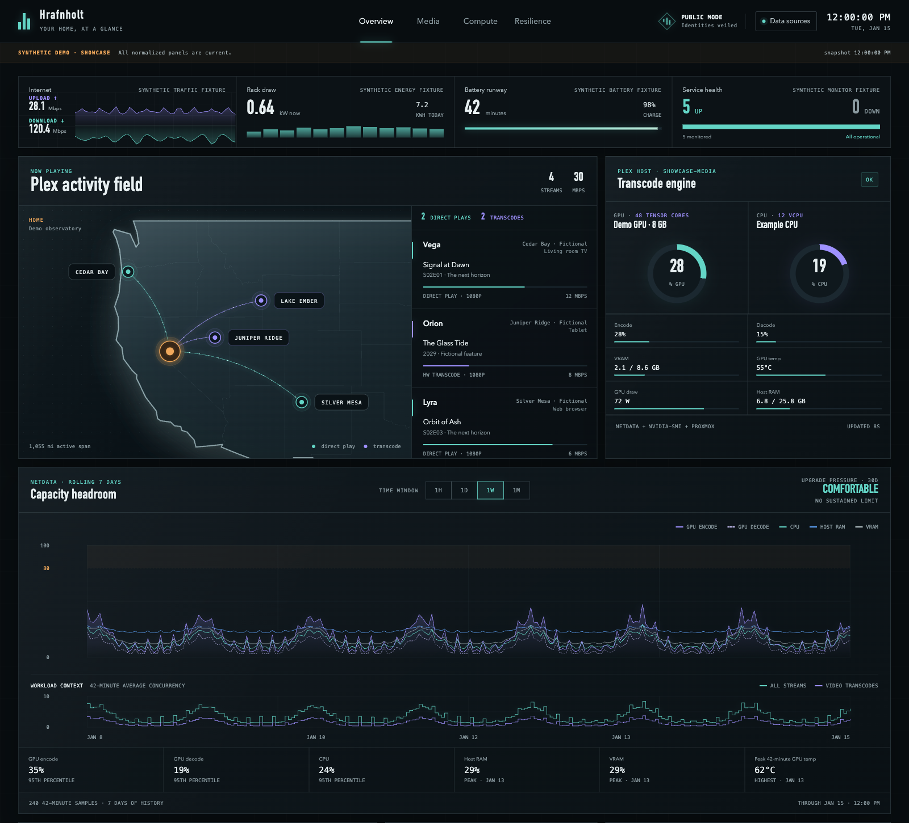

# Hrafnholt

**Your home servers, media, network, and energy use — on one dashboard.**

See what's playing on Plex, how your servers are doing, which services need
attention, and what your equipment costs to run. Hrafnholt reads information
from the services you connect; it does not change their settings or start jobs.

**[Try the live demo](https://hrafnholt.com/demo/)** · [Project website](https://hrafnholt.com/)

The public demo runs entirely on fictional data. Open it in your browser;
no installation or account is needed.

[](docs/images/dashboard-showcase-full.png)

*Entirely fictional showcase data, rendered by the real dashboard.
[View the full dashboard](docs/images/dashboard-showcase-full.png), including
media, containers, energy, and backups. The quick demo below uses a smaller
sample dataset and needs no service connections.*

## Connect the services you already use

You can start with just one service. Each connection is optional; unconfigured
panels show that their source is not configured. There is no automatic network
scan or requirement to own all of this equipment.

| What you want to see | Connect |
| --- | --- |
| Plex streams and approximate viewer locations | Tracearr |
| Internet upload/download and metered PDU outlets | UniFi Network |
| Server CPU, RAM, GPU, and capacity | Netdata |
| Virtual machines and cluster resources | Proxmox VE |
| Storage capacity | TrueNAS |
| Service up/down status | Uptime Kuma status page |
| Container status | Arcane |
| TV calendar and recently added movies | Sonarr and Radarr |
| Download queues | SABnzbd and qBittorrent |
| Backup and verification status | Proxmox VE and Proxmox Backup Server |
| UPS battery and runtime | APC-compatible SNMPv3 UPS |
| Household energy and estimated costs | Emporia Vue, with the optional energy service |

Connections are configured in a small text file. The setup guide shows exactly
which fields to change. There is currently no setup wizard in the dashboard.
See [connection settings](docs/COLLECTORS.md) for the full list.

## Try it first

You only need **Docker**. No programming, Node.js, API keys, or GitHub account
is needed for the demo.

1. Install and open [Docker Desktop](https://docs.docker.com/get-started/get-docker/)
   on Windows or Mac. Wait until it says the engine is running. On Linux, use
   [Docker Engine and Compose](https://docs.docker.com/compose/install/).
2. Open **Terminal** on Mac/Linux or **PowerShell** on Windows. Copy this whole
   command, paste it, and press Enter:

   ```bash
   docker run --rm --name hrafnholt-demo --platform linux/amd64 --read-only --cap-drop ALL --security-opt no-new-privileges --publish 127.0.0.1:3000:3000 ghcr.io/d4rk22/hrafnholt-dashboard@sha256:8757ee31b122947a9a52efd2bf8837ee409b963e7bc7029e5c0dcf68c899f7a5
   ```

3. Leave that window open and visit **[http://localhost:3000](http://localhost:3000)**
   on the same computer. The first download can take a few minutes. You should
   see **SYNTHETIC DEMO** and populated panels; none of the data is yours yet.

Press **Ctrl+C** in the terminal when finished. The demo container removes
itself. The long image address pins this example to the tested **v0.1.15**
release; copy it as-is. There is no Docker registry login to perform.

**Ready to use your own data? → [Follow the step-by-step setup guide](docs/SETUP.md).**
It includes downloadable Docker Compose files, a first connection that needs
no API key, a Sonarr example, and instructions for starting and stopping.

<details>
<summary>Something didn't work?</summary>

- **“docker” is not recognized / command not found:** finish installing Docker,
  then open a new terminal window.
- **Cannot connect to the Docker daemon:** open Docker Desktop and wait for it
  to start. On Linux, check that Docker is running and your account can use it.
- **Port is already allocated:** replace `127.0.0.1:3000:3000` in the command
  with `127.0.0.1:3001:3000`, then visit `http://localhost:3001`.
- **The container name is already in use:** stop the earlier demo with
  `docker stop hrafnholt-demo`, then try again.
- **Using a NAS or another server?** `localhost` means the device running Docker.
  See [access from another device](docs/SETUP.md#open-from-another-device).

The published images currently target **Linux x86-64 (amd64)**. The command
requests that platform explicitly; Apple Silicon needs Docker Desktop's x86
emulation. An ARM Linux host needs emulation configured separately.

</details>

## Keep your live dashboard private

Hrafnholt has **no built-in login**. The examples open it only on the computer
running Docker. Before sharing a live dashboard, put it behind authentication
and HTTPS. The browser's privacy mode hides names on screen; it does not remove
private information from the API. [Read the security guide](docs/SECURITY.md).

## Help and next steps

- [Set up your own dashboard](docs/SETUP.md)
- [Configuration reference](CONFIGURATION.md) and [supported connections](docs/COLLECTORS.md)
- [Troubleshooting](docs/TROUBLESHOOTING.md)
- [Latest release](https://github.com/d4rk22/hrafnholt/releases/latest) and [changelog](CHANGELOG.md)
- [Report a bug](https://github.com/d4rk22/hrafnholt/issues/new/choose)

<details>
<summary>For developers and advanced operators</summary>

[Build from source](docs/DEVELOPMENT.md) · [Architecture and API](docs/ARCHITECTURE.md) ·
[Secret injection](docs/SECRETS.md) · [Release process](docs/RELEASING.md) ·
[Asset provenance](docs/ASSET-PROVENANCE.md) · [Naming](docs/NAMING.md) ·
[Contributing](CONTRIBUTING.md) · [Code of conduct](CODE_OF_CONDUCT.md) ·
[Report a security issue](SECURITY.md)

</details>

## License

[Apache License 2.0](LICENSE). See [NOTICE](NOTICE).
